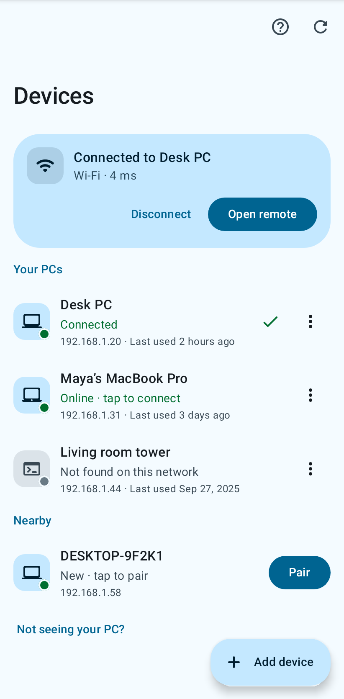
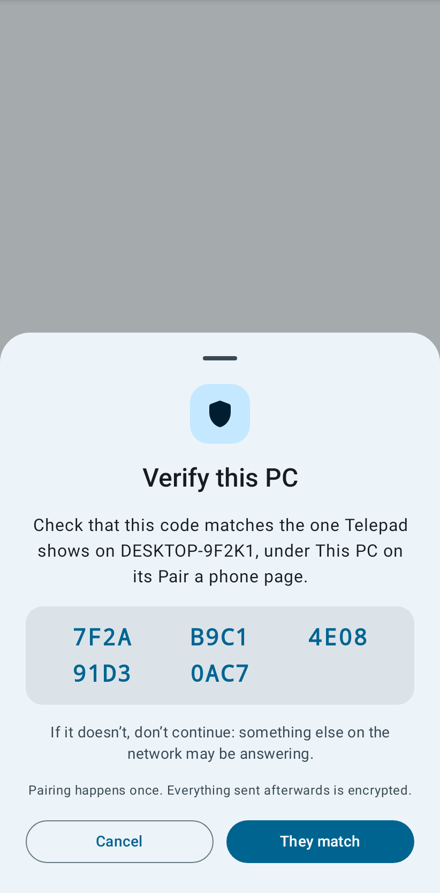
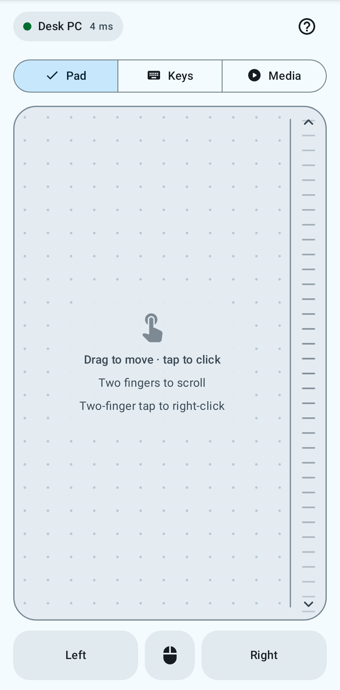
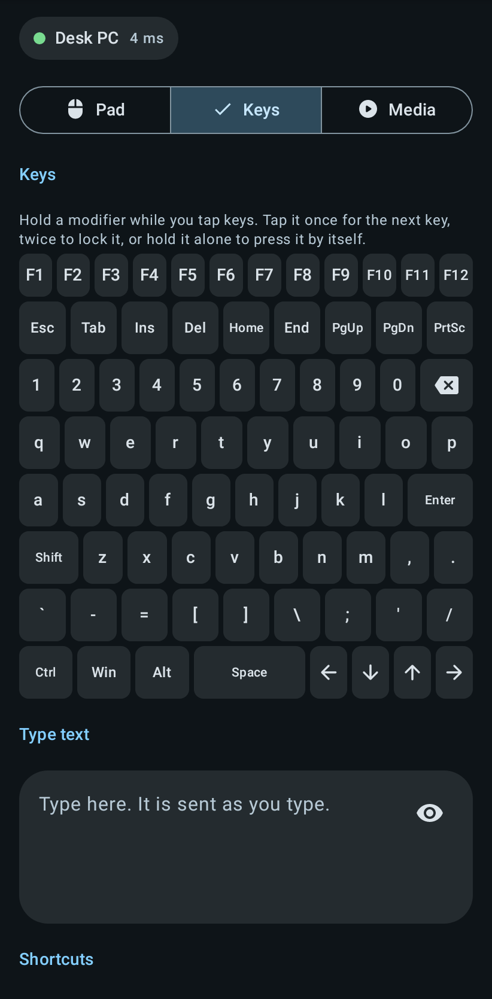

<div align="center">

<picture>
  <source media="(prefers-color-scheme: dark)" srcset="docs/brand/logo-dark.svg">
  
</picture>

**Your phone as a trackpad and keyboard for your computer.**

Windows, Linux and macOS, over Wi-Fi or Bluetooth. Open source, end-to-end encrypted, no account.

[**Website**](https://telepad-app.vercel.app) •
[**Download**](https://github.com/omsingh02/telepad/releases) •
[Changelog](CHANGELOG.md)

[](https://github.com/omsingh02/telepad/actions/workflows/ci.yml)
[](https://github.com/omsingh02/telepad/releases/latest)
[](LICENSE)
[](https://www.rust-lang.org/)
[](https://developer.android.com)

<table>
  <tr>
    <td></td>
    <td></td>
    <td></td>
    <td></td>
  </tr>
</table>

[Features](#features) •
[Using the app](#using-the-app) •
[Protocol & Architecture](#protocol--architecture) •
[Quick Start](#quick-start) •
[Building from Source](#building-from-source) •
[Troubleshooting](#troubleshooting) •
[Contributing](CONTRIBUTING.md)

</div>

---

## Overview

Telepad consists of two components:
1. **Android Client** (Kotlin / Jetpack Compose): turns touches, key presses and button taps into mouse, keyboard and media input, and sends them over encrypted UDP or Bluetooth.
2. **Desktop Server** (Rust): receives the packets, decrypts them, and injects mouse and keyboard events into the desktop through the native input API of each platform: Win32 `SendInput` on Windows, `/dev/uinput` on Linux, and CoreGraphics on macOS.

### Connection Modes

- **Wi-Fi Mode**:
  - Uses UDP over LAN (default port `5000`).
  - End-to-end encrypted using the **Noise IK** handshake (`Noise_IK_25519_ChaChaPoly_BLAKE2s`).
  - Uses Trust-On-First-Use (TOFU): the first time, the phone shows a 20-character fingerprint derived from the PC's public key, and you compare it with the one the PC shows. Once confirmed, later connections authenticate automatically. If a paired PC ever answers with a different key, the app warns you instead of connecting.
  - The PC also decides who may connect: a phone must be **paired** with the server before it can send input (see [Pairing](#pairing)).
  - Automatic discovery via IPv4 multicast (`239.255.42.67:5000`), broadcasts and, as a fallback, a sweep of the local subnet.
  - The connection is watched: if the PC stops answering the app shows *Reconnecting*, rebuilds the link in the background, and tells you why if it cannot.
- **Bluetooth Mode**:
  - Uses the Android `BluetoothHidDevice` API.
  - The phone acts as a standard Bluetooth human interface device (mouse and keyboard).
  - Does not require running the desktop server executable.

---

## Downloads

Standalone pre-built binaries are available under [**Releases**](https://github.com/omsingh02/telepad/releases/latest):

| Component | Target Platform | File |
| :--- | :--- | :--- |
| **Android Client** | Android 9.0+ (API 28+) | `telepad-android.apk` |
| **Desktop Server** | Windows 10 / 11 (x86_64) | `telepad-server-windows-x86_64.exe` (or `.zip`) |
| **Desktop Server** | Linux (x86_64, glibc 2.35+) | `telepad-server-linux-x86_64.tar.gz` |
| **Desktop Server** | macOS 11+ (Apple silicon and Intel) | `telepad-server-macos-universal.tar.gz` |

Each server is a single portable executable with no external runtime dependencies. Every file is also published with the version in its name (for example `telepad-android-v2.0.0.apk`), and all of them are listed with their SHA-256 in `SHA256SUMS`.

### Platform support

| | Windows | Linux | macOS |
| :--- | :---: | :---: | :---: |
| Mouse, scroll, keyboard, text | ✅ ¹ | ✅ | ✅ ¹ |
| Media and volume keys | ✅ ¹ | ✅ | ✅ ¹ |
| Quick launch actions, lock screen | ✅ ¹ | ✅ ² | ✅ ¹ |
| Clipboard sync | ✅ | ✅ | ✅ |
| Automatic discovery | ✅ | ✅ | ✅ |
| Now Playing metadata | ❌ ³ | ❌ ³ | ❌ ³ |

¹ Built and unit-tested on every CI run, but injecting real input needs a desktop session that CI does not have. On Windows it is checked by an `#[ignore]`d test you can run by hand (`cargo test -p telepad-platform --test windows_send_input -- --ignored`); the macOS backend has not yet been exercised on a physical Mac. Please report anything that misbehaves. (The Linux backend is checked against a real virtual input device whenever `/dev/uinput` can be opened.)
² Desktop environments differ here; see [Linux notes](#linux). Wayland and X11 both work.
³ Now Playing is not implemented in the Rust server yet, so the app does not show the card (the server tells the app what it supports).

---

## Features

### Mouse & Trackpad
- **A pad that teaches itself**: a ring where a click landed, a label saying "Right click" or "Dragging", a glow under every finger.
- **Gestures**, the ones from a laptop trackpad:
  - One finger: move the pointer. Tap: left click. Two quick taps: double-click.
  - Tap, then touch again and move: drag with the left button held.
  - Press and hold: right click. Two-finger tap: right click. Three-finger tap: middle click.
  - Two fingers up or down: scroll, with momentum after a flick (and natural/inverted scrolling).
  - A **scroll strip** along the pad's edge scrolls with one finger.
- **Mouse buttons**: left, middle and right buttons that go down when pressed and up when released, so you can hold one thumb on *Left* and drag with another finger to select.
- **Pointer feel**: speed, and four acceleration curves (None, Mac, Windows and Fixed). Sub-pixel carry means slow movement is never rounded away.
- **A live test pad** in the settings, with a pointer that moves as the real one would.

### Keyboard
- **Type with your phone's keyboard**: each edit is sent as it is made. Autocorrect and suggestions work, because the app works out the exact Backspaces and typing that give the PC the same text.
- **A full keyboard for keybinds**: letters, digits, punctuation, <kbd>F1</kbd>–<kbd>F12</kbd>, <kbd>Esc</kbd>, <kbd>Tab</kbd>, <kbd>Home</kbd>, <kbd>End</kbd>, <kbd>PgUp</kbd>, <kbd>PgDn</kbd>, <kbd>Ins</kbd>, <kbd>Del</kbd>, <kbd>PrtSc</kbd> and arrows. Every key goes down when touched and up when released, so holding one repeats.
- **Modifiers that work like the real thing**: <kbd>Ctrl</kbd>, <kbd>Alt</kbd>, <kbd>Shift</kbd> and <kbd>Win</kbd>/<kbd>⌘</kbd>/<kbd>Super</kbd>. Hold one with a finger and tap keys with another (Super and 2). Or tap it once for the next key, twice to lock it, or hold it alone to press it by itself (Super opens a launcher).
- **Shortcuts in the PC's own language**: Copy, Paste, Cut, Undo, Redo, Select all, Find, Save, New tab, Close tab, Refresh and Switch app, with the key names and combinations of the PC's operating system (<kbd>Ctrl+C</kbd> on Windows, <kbd>⌘C</kbd> on a Mac).
- **Clipboard**: *Paste from phone* and *Copy from PC* (Wi-Fi). It is always a button press, never automatic.

### Media & Remote
- Play/pause, next and previous; volume with hold-to-repeat, and mute.
- **Slides**: previous/next slide, start, black screen and end.
- **On the PC**: show desktop, task view / Mission Control / overview, task manager / force quit, screenshot, files, browser, lock screen.
- **Stay connected in the background** (optional): a notification with play/pause, volume and disconnect.

### Design
- Material 3 with colors generated from the accent you choose (or from your wallpaper with Material You), in light and dark. Every text and icon pair is tested to meet WCAG contrast.
- Works in portrait, landscape and on tablets, with TalkBack support (the pad has click and scroll actions for screen readers) and reduced-motion support.

---

## Using the app

The app has three places:

| | |
| :--- | :--- |
| **Devices** | PCs you have paired, PCs found on the network, and the ways to add one by address or over Bluetooth. Tap a PC to connect. |
| **Remote** | **Pad**, **Keys** and **Media**. Shows the connection (PC name and delay) at the top. |
| **Settings** | Touchpad, keyboard and clipboard, connection, appearance, privacy and security (paired PCs, this phone's key), about. |

### Gesture Mapping

On Windows the gestures are injected as the Win32 input below; Linux and macOS use the equivalent events (`BTN_LEFT`, `REL_WHEEL`, `kCGEventLeftMouseDown`, ...).

| Gesture | Injected Win32 Input | Win32 Flags |
| :--- | :--- | :--- |
| **1-finger move** | Mouse move | `MOUSEEVENTF_MOVE` |
| **1-finger tap** | Left click | `MOUSEEVENTF_LEFTDOWN` then `MOUSEEVENTF_LEFTUP` |
| **2 quick taps** | Two left clicks (the PC sees a double-click) | as above, twice |
| **2-finger tap / press and hold** | Right click | `MOUSEEVENTF_RIGHTDOWN` then `MOUSEEVENTF_RIGHTUP` |
| **3-finger tap** | Middle click | `MOUSEEVENTF_MIDDLEDOWN` then `MOUSEEVENTF_MIDDLEUP` |
| **Tap, then touch and move** | Left drag | `MOUSEEVENTF_LEFTDOWN` held until the finger lifts |
| **2-finger vertical drag / scroll strip** | Scroll wheel | `MOUSEEVENTF_WHEEL` (multiplied by `WHEEL_DELTA = 120`) |

### Over Bluetooth

A Bluetooth keyboard can only send key presses, so over Bluetooth: typing works for English letters, digits and punctuation (the app tells you when something could not be typed), there is no clipboard, and the system actions are sent as the PC's own keyboard shortcut where it has one. Tell the app which operating system the PC runs under **Settings → Keyboard and clipboard**.

---

## Protocol & Architecture

Telepad uses a custom compact binary protocol over UDP.

```
+---------------------------------------------------------------------------------+
|                              CONNECTION LIFECYCLE                               |
+---------------------------------------------------------------------------------+

   ANDROID CLIENT                                           DESKTOP SERVER (RUST)
         |                                                           |
         | 1. Multicast Discovery (239.255.42.67:5000)               |
         |---------------------------------------------------------->|
         |    [0xC3][Magic: 8 bytes]                                 |
         |                                                           |
         | 2. Discovery Reply                                        |
         |<----------------------------------------------------------|
         |    [0xC4] + "TELEPAD_PONG:<Hostname>"                     |
         |                                                           |
         | 3. Public key request (to know who it is, and to pair)    |
         |---------------------------------------------------------->|
         |    [0xC5]                                                 |
         |<----------------------------------------------------------|
         |    [0xC6] + [32-byte X25519 static public key]            |
         |                                                           |
         |    [TOFU: compare the 20-char fingerprint with the PC's]  |
         |                                                           |
         | 4. Noise IK Handshake                                     |
         |---------------------------------------------------------->|
         |    Msg 1 [0xC0] + [96 bytes: e, es, s, ss]                |
         |<----------------------------------------------------------|
         |    Msg 2 [0xC1] + [48 bytes: e, ee, se]                   |
         |    (or [0xC7] if this phone is not paired: see Pairing)   |
         |                                                           |
         | 5. Encrypted Transport Stream (ChaCha20-Poly1305)         |
         |==========================================================>|
         |    [0xC2] + [Encrypted payload + 16-byte Poly1305 tag]    |
         |                                                           |
         | 6. Every ~2 s: host-info query; the answer proves the PC  |
         |    is still there and measures the delay                  |
         |                                                           |
         |                                                7. Inject input on the PC
         +                                                           +
```

### Protocol Specifications

- **Cipher Suite**: `Noise_IK_25519_ChaChaPoly_BLAKE2s`
  - DH: X25519
  - Cipher: ChaCha20-Poly1305 (16-byte authentication tag)
  - Hash: BLAKE2s
- **Wire Framing** (first byte of every UDP datagram):
  - `0xC0`: `WIRE_HANDSHAKE_INIT` (96 bytes)
  - `0xC1`: `WIRE_HANDSHAKE_RESP` (48 bytes)
  - `0xC2`: `WIRE_TRANSPORT` (encrypted payload)
  - `0xC3`: `WIRE_DISCOVERY_PROBE` (magic: `0x54, 0xE7, 0x9A, 0x03, 0x21, 0xC8, 0xBE, 0xFE` or `b"TELEPAD!"`)
  - `0xC4`: `WIRE_DISCOVERY_REPLY` (`"TELEPAD_PONG:<hostname>"`)
  - `0xC5`: `WIRE_PAIRING_INTRO_REQ`
  - `0xC6`: `WIRE_PAIRING_INTRO_RESP` (32 bytes public key)
  - `0xC7`: `WIRE_PAIRING_REJECTED` (sent instead of `0xC1` when the phone is not paired and pairing is closed)
- **Transport Payload Framing** (inside encrypted stream):
  - `0x01`: MouseMove (`[i16 dx][i16 dy]`, little-endian)
  - `0x02`: MouseButton (`[u8 button][u8 pressed]`)
  - `0x03`: Scroll (`[i16 delta]`, in wheel notches)
  - `0x04`: KeyPress (`[u16 keycode][u8 modifiers]`)
  - `0x05`: KeyRelease (`[u16 keycode][u8 modifiers]`)
  - `0x06`: TextInput (`[u16 len][utf-8 bytes]`)
  - `0x07`: MediaCmd (`[u8 action]`)
  - `0x08`: VolumeCmd (`[u8 direction]`)
  - `0x09`: LockScreen
  - `0x0E`: ClipboardGet
  - `0x0F`: ClipboardSet (`[u16 len][utf-8 bytes]`)
  - `0x10`: LaunchAction (`[u8 action]`)
  - `0x11`: NowPlayingQuery
  - `0x12`: HostInfoQuery
  - `0x80`: ClipboardData (`[u16 len][utf-8 bytes]`)
  - `0x81`: NowPlaying (`[flags][pos: i64][dur: i64][strings...]`)
  - `0x82`: HostInfo (`[os: u8][capabilities: u8][major][minor][patch]`; `os` is 1 Windows, 2 macOS, 3 Linux; capabilities are `0x01` now-playing and `0x02` clipboard; later versions may append fields, which readers ignore)
- **Fingerprint Calculation**:
  - `SHA256(server_static_public_key)[0..10]` formatted as five groups of four hex digits: `XXXX · XXXX · XXXX · XXXX · XXXX` (80 bits). The key is not secret, so an impostor can search in advance for a key with a matching fingerprint; 80 bits puts that out of reach (the 48 bits of earlier versions did not). The first three groups equal the shorter fingerprint older versions showed.
- **Key Storage**:
  - Windows: `%APPDATA%\Telepad\identity.key` (DPAPI-protected) and `trusted_clients.json`.
  - macOS: `~/Library/Application Support/Telepad/`.
  - Linux: `$XDG_CONFIG_HOME/telepad/` (default `~/.config/telepad/`); `identity.key` is readable only by you.
  - Override with `--key-dir`.
  - Android: `EncryptedSharedPreferences` backed by Android Keystore. A PC is identified by its public key, not its address, so a PC that gets a new IP is still the same PC.

### Android app structure

```
com.omsingh.telepad
├── core/            logic with no UI: the pieces below are plain Kotlin and unit-tested
│   ├── input/       gesture engine, keyboard session (sticky modifiers), text diffing, HID codes
│   ├── host/        what the PC runs: key names and shortcuts per OS, host-info messages
│   ├── trust/       paired devices, the trust decision (new / known / changed key), the device list
│   ├── wifi/        discovery, the encrypted UDP transport with heartbeat and reconnection
│   ├── bluetooth/   HID keyboard state and the translator from input events to HID reports
│   └── connection/  reconnect schedule and link-liveness bookkeeping
├── connection/      ConnectionManager: who is connected, the pairing conversation
├── settings/        preferences (DataStore)
├── service/         optional foreground service with a small remote in its notification
└── ui/              theme (colors generated in OKLCH), components, and the three places
```

The network code is tested end to end against a stand-in PC that speaks the real protocol on loopback, and the whole connection manager (including every trust decision) is tested against it. `Fixtures` and the screenshot tests render every screen without a device.

---

## Quick Start

### Wi-Fi Mode

1. **Start the Desktop Server** on your PC (Linux and macOS need a one-time setup first; see [Linux](#linux) and [macOS](#macos)):
   ```bash
   # Windows
   telepad-server-<version>-windows-x86_64.exe
   # Linux / macOS
   ./telepad-server
   ```
   The server prints its identity and fingerprint:
   ```
   ==================================================
    Telepad Desktop Server v2.0.0 (Rust)
    Port:        5000
    Hostname:    DESKTOP-PC
    Fingerprint: 7F2A · B9C1 · 4E08 · 91D3 · 0AC7
    Input:       Windows SendInput
    Pairing:     OPEN for 299 s: connect your phone now
   ==================================================
   ```

2. **Connect from Android**:
   - Connect the phone to the same local network.
   - Open Telepad. PCs running the server appear on the **Devices** tab.
   - Tap your PC, then tap **Pair**.

3. **Verify the Fingerprint (first connection only)**:
   - Check that the code on your phone matches the one in the server console.
   - Tap **They match**. From now on tapping the PC connects straight away.

### Pairing

A phone can only control the PC after it has been **paired**, and the PC decides when that may happen, so that nobody else on the network can type on your computer.

- **First run:** nothing is paired yet, so the server accepts a new phone for the first 5 minutes. Connect yours in that time.
- **The window is for one phone.** It closes by itself as soon as a phone has paired (or when the time is up), so nobody else on the network can slip in behind yours. The server console says so when it happens.
- **Adding another phone later:** type `pair` in the server's console window (optionally `pair 120` for 120 seconds), then connect the new phone. Type `close` to shut the window early.
- **Running without a console** (a service, a startup item): start the server with `--pair` (5 minutes) or `--pair 120` for the window to open at launch.
- Paired phones keep working across restarts. `list` shows them, `forget` unpairs all of them.
- A phone that is not paired is refused, and the server console says so (`refused 192.168.0.23: device ... has not been paired`). The app says so too, and what to do.

Console commands: `pair [seconds]`, `close`, `list`, `forget`, `status`, `help`, `quit`.

> `--insecure-accept-any-client` restores the old behaviour of accepting every phone forever. Anyone who can reach the server's UDP port can then control the machine, so only use it on a network you fully trust.

### Bluetooth Mode

> **Requirement**: Android 9.0+ with firmware support for the Bluetooth HID Device profile (`BluetoothHidDevice`). Some OEM builds disable this profile in software.

1. In Telepad, tap **Add device → Bluetooth** and follow the steps: open the phone's Bluetooth settings (the phone is visible to other devices while they are open), and on the PC add a Bluetooth device and choose the phone.
2. Back in Telepad, choose the PC from the list. The app asks for the Bluetooth permission only now.

---

## Platform Notes

### Linux

The server creates a virtual mouse and keyboard with the kernel's `uinput` interface, so it works under **Wayland and X11** alike. It needs permission to open `/dev/uinput`. Many desktops grant this to the logged-in user automatically; if the server reports "permission denied", set it up once:

```bash
sudo modprobe uinput
echo uinput | sudo tee /etc/modules-load.d/uinput.conf          # load it at every boot
echo 'KERNEL=="uinput", GROUP="input", MODE="0660", OPTIONS+="static_node=uinput"' \
  | sudo tee /etc/udev/rules.d/60-telepad-uinput.rules
sudo udevadm control --reload && sudo udevadm trigger
sudo usermod -aG input "$USER"                                   # then log out and back in
```

- Run the server as your normal user, inside your desktop session. Launching programs, locking the screen and the clipboard all need that session.
- **Typing text** assumes a US-style layout for ASCII characters. Characters outside ASCII (accents, emoji, other scripts) are entered with the `Ctrl+Shift+U` Unicode sequence, which GTK applications and IBus support; some terminals and Qt apps do not. If your layout is not US-compatible (so "y" and "z" come out swapped, for example), start the server with `--text-via-unicode` to type every character that way instead. It works regardless of layout, but only in applications that accept the Unicode sequence.
- **Quick actions** use what each desktop provides: `Super+D` (show desktop), `Super` (GNOME overview) or `Super+W` (KDE overview), `Print` (screenshot), `xdg-open` (browser and files), `loginctl lock-session` (with several fallbacks) and the first installed system monitor. GNOME and KDE are covered; other desktops may differ.
- **Clipboard** uses the X11 clipboard (on Wayland, through XWayland). How well that is bridged on a pure-Wayland desktop varies; text typed from the phone does not depend on it.
- Open the port if you use a firewall: `sudo ufw allow 5000/udp` or `sudo firewall-cmd --add-port=5000/udp --permanent && sudo firewall-cmd --reload`.

### macOS

- On first use macOS asks you to allow the program to control the computer. Enable it in **System Settings > Privacy & Security > Accessibility** (for the terminal you start it from, or for the binary itself). Without this, macOS silently discards every injected event.
- The download is not notarised, so macOS quarantines it. Clear that once: `xattr -d com.apple.quarantine ./telepad-server`.
- The phone's **Win** key acts as **⌘ Command** and **Alt** as **⌥ Option**, as with any PC keyboard on a Mac. To make Windows-style shortcuts work as they do on Windows, start the server with `--mac-ctrl-as-cmd`, which makes the phone's Ctrl act as ⌘ (and Win as Control). The app already sends ⌘ shortcuts when it knows the PC is a Mac.
- Allow incoming connections when macOS asks, or add the program in **Network > Firewall**.

### Windows

- Allow inbound UDP port 5000 in Windows Firewall (see [Troubleshooting](#troubleshooting)).
- The server cannot inject input into elevated windows (an administrator command prompt, UAC prompts) unless it is run as administrator.

---

## Building from Source

### Prerequisites
- **Rust**: a current stable toolchain (`rustup toolchain install stable`). CI builds with stable; no older version is tested.
- **Linux only**: the X11 client libraries used by the clipboard (`sudo apt-get install libxcb-shape0-dev libxcb-xfixes0-dev` on Debian/Ubuntu)
- **Android**: JDK 17, Android SDK 35 (a much newer default Java, such as 27, stops Gradle with `What went wrong: 27`: set `JAVA_HOME` to a JDK 17)

### 1. Build Desktop Server (Rust)

```bash
git clone https://github.com/omsingh02/telepad.git
cd telepad

cargo build --release --bin telepad-server
# Executable: target/release/telepad-server   (telepad-server.exe on Windows)
```

Run test suite:
```bash
cargo test --workspace
cargo clippy --workspace --all-targets -- -D warnings
cargo fmt --all
```
The suite includes end-to-end tests that run the real server against a real Noise client over loopback sockets, so protocol and security behaviour is verified on all three platforms in CI. Tests that need the real operating system (the Linux `uinput` read-back test, the Windows cursor test) skip themselves or are `#[ignore]`d when the environment cannot provide it.

### 2. Build Android App (Kotlin / Compose)

```bash
cd android

# Build debug APK:
./gradlew assembleDebug
# Generated at: app/build/outputs/apk/debug/app-debug.apk

# Build release APK (minified with R8; unsigned unless a keystore is configured):
./gradlew assembleRelease

# Run unit tests (logic, network against a loopback PC, screens with Robolectric):
./gradlew testDebugUnitTest
```

The first test run downloads Robolectric's Android runtime (about 150 MB). The screenshots in `android/app/src/test/screenshots` are produced by the same tests:

```bash
./gradlew recordRoborazziDebug    # redraw them after a design change
./gradlew verifyRoborazziDebug    # fail if any screen no longer looks like its picture
```

See [CONTRIBUTING.md](CONTRIBUTING.md) for more.

---

## Troubleshooting

### PC not found during auto-discovery
1. **Firewall**: allow inbound UDP on port 5000.
   - Windows:
     ```powershell
     New-NetFirewallRule -DisplayName "Telepad Server" -Direction Inbound -LocalPort 5000 -Protocol UDP -Action Allow
     ```
   - Linux: `sudo ufw allow 5000/udp` (or the `firewall-cmd` line above).
   - macOS: click **Allow** on the "accept incoming network connections" prompt.
2. **Access Point Isolation**: some guest Wi-Fi networks and mesh routers block device-to-device UDP traffic.
3. **Manual IP Connection**: tap **Add device** in the app, choose **Address**, and enter your PC's local IP address (`ipconfig` on Windows, `ip addr` on Linux, `ipconfig getifaddr en0` on macOS). The app asks the PC for its name and key, so you still verify the fingerprint.

### "…hasn't accepted this phone"
The server console probably says `refused ...: device ... has not been paired`. Type `pair` in the server console (or restart with `--pair`) and tap **Try again**.

### The server will not start on Linux ("permission denied" on /dev/uinput)
Follow the [Linux setup](#linux). Use `--no-input` to run the protocol without injecting input, which is handy for diagnostics.

### Connected, but nothing moves on macOS
macOS is discarding the events. Grant Accessibility access as described in [macOS](#macos).

### Cursor feels jittery, too slow or too fast
- Open **Settings → Touchpad**: there is a pad at the top to try changes on right away. *Pointer speed* and *Acceleration* decide the feel. *None* moves the pointer in proportion to your finger at the chosen speed; *Fixed* is exactly 1:1 and ignores the speed setting.
- **Battery Optimization**: on Android, set Telepad battery usage to **Unrestricted** (`Settings` → `Apps` → `Telepad` → `Battery`) to prevent background throttling, or switch on **Stay connected in the background**.

### "…has a new identity" (key warning)
The app compared the PC's key with the one it paired and they differ. That happens if Telepad was reinstalled on the PC (or its key folder was deleted). It can also mean something else on the network is pretending to be the PC, which is why the app asks you to compare the fingerprint again. Only continue if you know the PC's key changed and the code matches what the PC shows now. To clear an old entry, forget the PC under **Settings → Privacy and security**.

### Keys or buttons stay pressed after the phone disconnects
The server releases anything a phone was holding once it has been silent for 10 seconds. If you see this persist, run with `--verbose` and report it.

---

## Project Structure

```
telepad/
├── android/                    # Android client (Kotlin + Jetpack Compose)
│   ├── app/src/main/           # app code (see "Android app structure" above)
│   ├── app/src/test/           # unit, network, screen and screenshot tests
│   └── app/src/test/screenshots/   # the pictures of every screen
├── crates/                     # Rust Desktop Server Workspace
│   ├── telepad-server/         # Tokio UDP server: discovery, pairing, sessions, console
│   ├── telepad-platform/       # OS layer: Windows SendInput, Linux uinput, macOS CoreGraphics,
│   │                           #   clipboard, network interfaces, config paths
│   ├── telepad-crypto/         # Noise IK handshake, ChaCha20-Poly1305, key storage
│   └── telepad-protocol/       # Binary wire protocol definitions and codecs
├── website/                    # the landing page (plain HTML and CSS, served by Vercel)
├── docs/                       # brand assets (logo, social image) and the manual test plan
├── .github/                    # CI and release workflows, issue and pull request templates
├── Cargo.toml                  # Cargo workspace
├── CHANGELOG.md                # what changed in each release
├── CONTRIBUTING.md             # how to build, test and contribute
├── SECURITY.md                 # security model and how to report a vulnerability
└── README.md
```

---

## Contributing

Bug reports, ideas and patches are welcome. [CONTRIBUTING.md](CONTRIBUTING.md) explains how to build and test both halves, and [SECURITY.md](SECURITY.md) how to report a vulnerability privately.

## License

Distributed under the [MIT License](LICENSE).
