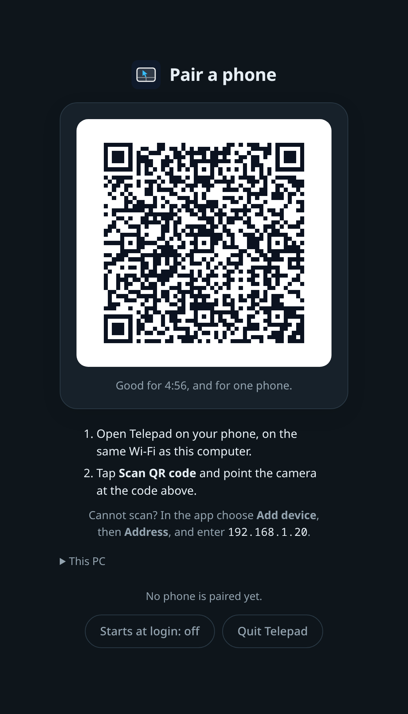

<div align="center">

<picture>
  <source media="(prefers-color-scheme: dark)" srcset="docs/brand/logo-dark.svg">
  
</picture>

**Your phone as a trackpad and keyboard for your computer.**

Windows, Linux and macOS, over Wi-Fi or Bluetooth. Open source, end-to-end encrypted, no account.

[**Website**](https://telepad-app.vercel.app) •
[**Download**](https://github.com/omsingh02/telepad/releases) •
[Changelog](CHANGELOG.md)

[](https://github.com/omsingh02/telepad/actions/workflows/ci.yml)
[](https://github.com/omsingh02/telepad/releases/latest)
[](LICENSE)
[](https://www.rust-lang.org/)
[](https://developer.android.com)

<table>
  <tr>
    <td></td>
    <td></td>
    <td></td>
    <td></td>
    <td></td>
  </tr>
</table>

[Features](#features) •
[Using the app](#using-the-app) •
[Protocol & Architecture](#protocol--architecture) •
[Quick Start](#quick-start) •
[Building from Source](#building-from-source) •
[Troubleshooting](#troubleshooting) •
[Contributing](CONTRIBUTING.md)

</div>

---

## Overview

Telepad consists of two components:
1. **Android Client** (Kotlin / Jetpack Compose): turns touches, key presses and button taps into mouse, keyboard and media input, and sends them over encrypted UDP or Bluetooth.
2. **Desktop app** (Rust): it sits in the tray (the menu bar on a Mac) and starts when you sign in. It shows the QR code you pair a phone with, receives the packets, decrypts them, and injects mouse and keyboard events into the desktop through the native input API of each platform: Win32 `SendInput` on Windows, `/dev/uinput` on Linux, and CoreGraphics on macOS. The same server is also available as `telepad-server`, a console program for PCs without a desktop and for people who like a terminal.

### Connection Modes

- **Wi-Fi Mode**:
  - Uses UDP over LAN (default port `5000`).
  - End-to-end encrypted using the **Noise IK** handshake (`Noise_IK_25519_ChaChaPoly_BLAKE2s`).
  - **Pairing by QR code**: the PC shows a QR code, you scan it with the app, and that is all. The code carries the PC's public key (so there is nothing to compare: it came from the PC's own screen) and a one-time token that lets that one phone pair. If you cannot scan, pick the PC in the list instead and compare the 20-character fingerprint the phone shows with the one the PC shows (Trust-On-First-Use). Once paired, later connections authenticate automatically. If a paired PC ever answers with a different key, the app warns you instead of connecting.
  - The PC also decides who may connect: a phone must be **paired** with the server before it can send input (see [Pairing](#pairing)).
  - Automatic discovery via IPv4 multicast (`239.255.42.67:5000`), broadcasts and, as a fallback, a sweep of the local subnet.
  - The connection is watched: if the PC stops answering the app shows *Reconnecting*, rebuilds the link in the background, and tells you why if it cannot.
- **Bluetooth Mode**:
  - Uses the Android `BluetoothHidDevice` API.
  - The phone acts as a standard Bluetooth human interface device (mouse and keyboard).
  - Does not require running the desktop server executable.

---

## Downloads

Pre-built files are under [**Releases**](https://github.com/omsingh02/telepad/releases). Pick the one for each of your devices:

| For | Platform | File |
| :--- | :--- | :--- |
| **Your phone** | Android 9.0+ (API 28+) | `telepad-android.apk` |
| **Your PC** | Windows 10 / 11 (x86_64) | `telepad-windows-x86_64-setup.exe` (installer), or `telepad-windows-x86_64.exe` to run without installing |
| **Your PC** | macOS 11+ (Apple silicon and Intel) | `telepad-macos-universal.dmg` |
| **Your PC** | Linux (x86_64, glibc 2.34+) | `curl -fsSL https://telepad-app.vercel.app/install.sh \| sh`, or `telepad-linux-x86_64.deb` (Debian, Ubuntu, Mint), `.rpm` (Fedora, openSUSE), `.pkg.tar.zst` (Arch) or `.tar.gz` (then `./install.sh`) |
| *Console server* | any of the above, no tray | `telepad-server-windows-x86_64.exe` (or `.zip`), `telepad-server-linux-x86_64.tar.gz`, `telepad-server-macos-universal.tar.gz` |

Every file is also published with the version in its name (for example `telepad-android-v2.0.0.apk`). All of them are listed with their SHA-256 in `SHA256SUMS`, and each one has a [build attestation](#checking-a-download): a signed statement of which build, from which commit, produced it.

**Your system may warn you the first time.** Builds are not code-signed yet (see [docs/code-signing.md](docs/code-signing.md)), so Windows shows *Windows protected your PC* (choose **More info**, then **Run anyway**), macOS says it cannot verify the app (**System Settings → Privacy & Security → Open Anyway**), and Android asks to allow installs from your browser or file manager. The warnings go away as signing is set up; until then, [check the download](#checking-a-download) if you want to be sure.

### Checking a download

```bash
sha256sum -c SHA256SUMS --ignore-missing                       # the file is the one that was published
gh attestation verify telepad-android.apk --repo omsingh02/telepad   # and GitHub built it from this repository
```

### Updates

Telepad never connects to the internet by itself, so it does not check for updates. New versions are on the [releases page](https://github.com/omsingh02/telepad/releases) (the tray page has an **Updates** link). To update, install the new file over the old one: the Windows installer and `install.sh` replace the running copy, on Linux the one command above (or `sudo apt install ./telepad-….deb`, `sudo dnf install ./telepad-….rpm`, `sudo pacman -U telepad-….pkg.tar.zst`) upgrades it, and the phone app updates in place. To have the phone app updated for you, add this repository to [Obtainium](https://obtainium.imranr.dev) (**Add app**, paste `https://github.com/omsingh02/telepad`, and turn on *Include prereleases* while the releases are alphas). Settings and paired phones are kept across updates.

### Platform support

| | Windows | Linux | macOS |
| :--- | :---: | :---: | :---: |
| Mouse, scroll, keyboard, text | ✅ ¹ | ✅ | ✅ ¹ |
| Media and volume keys | ✅ ¹ | ✅ | ✅ ¹ |
| Quick launch actions, lock screen | ✅ ¹ | ✅ ² | ✅ ¹ |
| Clipboard sync | ✅ | ✅ | ✅ |
| Automatic discovery | ✅ | ✅ | ✅ |
| Now Playing metadata | ❌ ³ | ❌ ³ | ❌ ³ |

¹ Built and unit-tested on every CI run, but injecting real input needs a desktop session that CI does not have. On Windows it is checked by an `#[ignore]`d test you can run by hand (`cargo test -p telepad-platform --test windows_send_input -- --ignored`); the macOS backend has not yet been exercised on a physical Mac. Please report anything that misbehaves. (The Linux backend is checked against a real virtual input device whenever `/dev/uinput` can be opened.)
² Desktop environments differ here; see [Linux notes](#linux). Wayland and X11 both work.
³ Now Playing is not implemented in the Rust server yet, so the app does not show the card (the server tells the app what it supports).

---

## Features

### Mouse & Trackpad
- **A pad that teaches itself**: a ring where a click landed, a label saying "Right click" or "Dragging", a glow under every finger.
- **Gestures**, the ones from a laptop trackpad:
  - One finger: move the pointer. Tap: left click. Two quick taps: double-click.
  - Tap, then touch again and move: drag with the left button held.
  - Press and hold: right click. Two-finger tap: right click. Three-finger tap: middle click.
  - Two fingers up or down: scroll, with momentum after a flick (and natural/inverted scrolling).
  - A **scroll strip** along the pad's edge scrolls with one finger.
- **Mouse buttons**: left, middle and right buttons that go down when pressed and up when released, so you can hold one thumb on *Left* and drag with another finger to select.
- **Pointer feel**: speed, and four acceleration curves (None, Mac, Windows and Fixed). Sub-pixel carry means slow movement is never rounded away.
- **A live test pad** in the settings, with a pointer that moves as the real one would.

### Keyboard
- **Type with your phone's keyboard**: swipe typing, autocorrect, voice and every language work, because it is the phone's own keyboard. What you type is sent to the PC; words are sent when the keyboard has finished with them, so a correction never reaches the PC as a typo. *Send each key at once* in the menu turns suggestions off and sends every key as it is pressed.
- **The keys a phone keyboard lacks, right above it**: <kbd>Esc</kbd>, <kbd>Tab</kbd>, <kbd>Ctrl</kbd>, <kbd>Alt</kbd>, <kbd>Shift</kbd>, <kbd>Win</kbd>/<kbd>⌘</kbd>/<kbd>Super</kbd>, the arrows, <kbd>Home</kbd>, <kbd>End</kbd> and <kbd>Del</kbd>, with <kbd>F1</kbd>–<kbd>F12</kbd>, <kbd>PgUp</kbd>, <kbd>PgDn</kbd>, <kbd>Ins</kbd> and <kbd>PrtSc</kbd> one tap away on <kbd>Fn</kbd>. Holding an arrow repeats it on the PC.
- **Modifiers that work like the real thing**: tap <kbd>Ctrl</kbd> and then a letter on your keyboard, and the PC receives <kbd>Ctrl+C</kbd>. Tap a modifier once for the next key, twice to keep it on, or hold it with one finger while another taps a key. Held on its own for a moment, a key is pressed by itself (<kbd>Super</kbd> opens a launcher). A modifier that is still on is shown on every tab, so it cannot be forgotten.
- **A PC keyboard for keybinds**: every key of a real keyboard, for the keybinds that need them (choose it from the menu; it is what a phone held sideways shows). The keys' touch areas fill the gaps between them, so a finger between two keys still presses one.
- **Shortcuts in the PC's own language**: Copy, Paste, Cut, Undo, Redo, Select all, Find, Save, New tab, Close tab, Refresh and Switch app, with the key names and combinations of the PC's operating system (<kbd>Ctrl+C</kbd> on Windows, <kbd>⌘C</kbd> on a Mac).
- **Clipboard**: *Paste from phone* and *Copy from PC* (Wi-Fi). It is always a button press, never automatic.

### Media & Remote
- Play/pause, next and previous; volume with hold-to-repeat, and mute.
- **Slides**: previous/next slide, start, black screen and end.
- **On the PC**: show desktop, task view / Mission Control / overview, task manager / force quit, screenshot, files, browser, lock screen.
- **Stay connected in the background** (optional): a notification with play/pause, volume and disconnect.

### Design
- Material 3 with colors generated from the accent you choose (or from your wallpaper with Material You), in light and dark. Every text and icon pair is tested to meet WCAG contrast.
- Works in portrait, landscape and on tablets, with TalkBack support (the pad has click and scroll actions for screen readers) and reduced-motion support.

---

## Using the app

The app has three places:

| | |
| :--- | :--- |
| **Devices** | PCs you have paired, PCs found on the network, and the ways to add one by address or over Bluetooth. Tap a PC to connect. |
| **Remote** | **Pad**, **Keys** and **Media**. Shows the connection (PC name and delay) at the top. |
| **Settings** | Touchpad, keyboard and clipboard, connection, appearance, privacy and security (paired PCs, this phone's key), about. |

### Gesture Mapping

On Windows the gestures are injected as the Win32 input below; Linux and macOS use the equivalent events (`BTN_LEFT`, `REL_WHEEL`, `kCGEventLeftMouseDown`, ...).

| Gesture | Injected Win32 Input | Win32 Flags |
| :--- | :--- | :--- |
| **1-finger move** | Mouse move | `MOUSEEVENTF_MOVE` |
| **1-finger tap** | Left click | `MOUSEEVENTF_LEFTDOWN` then `MOUSEEVENTF_LEFTUP` |
| **2 quick taps** | Two left clicks (the PC sees a double-click) | as above, twice |
| **2-finger tap / press and hold** | Right click | `MOUSEEVENTF_RIGHTDOWN` then `MOUSEEVENTF_RIGHTUP` |
| **3-finger tap** | Middle click | `MOUSEEVENTF_MIDDLEDOWN` then `MOUSEEVENTF_MIDDLEUP` |
| **Tap, then touch and move** | Left drag | `MOUSEEVENTF_LEFTDOWN` held until the finger lifts |
| **2-finger vertical drag / scroll strip** | Scroll wheel | `MOUSEEVENTF_WHEEL` (multiplied by `WHEEL_DELTA = 120`) |

### Over Bluetooth

A Bluetooth keyboard can only send key presses, so over Bluetooth: typing works for English letters, digits and punctuation (the app tells you when something could not be typed), there is no clipboard, and the system actions are sent as the PC's own keyboard shortcut where it has one. Tell the app which operating system the PC runs under **Settings → Keyboard and clipboard**.

---

## Protocol & Architecture

Telepad uses a custom compact binary protocol over UDP.

```
+---------------------------------------------------------------------------------+
|                              CONNECTION LIFECYCLE                               |
+---------------------------------------------------------------------------------+

   ANDROID CLIENT                                           DESKTOP SERVER (RUST)
         |                                                           |
         | 1. Multicast Discovery (239.255.42.67:5000)               |
         |---------------------------------------------------------->|
         |    [0xC3][Magic: 8 bytes]                                 |
         |                                                           |
         | 2. Discovery Reply                                        |
         |<----------------------------------------------------------|
         |    [0xC4] + "TELEPAD_PONG:<Hostname>"                     |
         |                                                           |
         | 3. Public key request (to know who it is, and to pair)    |
         |---------------------------------------------------------->|
         |    [0xC5]                                                 |
         |<----------------------------------------------------------|
         |    [0xC6] + [32-byte X25519 static public key]            |
         |                                                           |
         |    [TOFU: compare the 20-char fingerprint with the PC's]  |
         |                                                           |
         | 4. Noise IK Handshake                                     |
         |---------------------------------------------------------->|
         |    Msg 1 [0xC0] + [96 bytes: e, es, s, ss]                |
         |<----------------------------------------------------------|
         |    Msg 2 [0xC1] + [48 bytes: e, ee, se]                   |
         |    (or [0xC7] if this phone is not paired: see Pairing)   |
         |                                                           |
         | 5. Encrypted Transport Stream (ChaCha20-Poly1305)         |
         |==========================================================>|
         |    [0xC2] + [Encrypted payload + 16-byte Poly1305 tag]    |
         |                                                           |
         | 6. Every ~2 s: host-info query; the answer proves the PC  |
         |    is still there and measures the delay                  |
         |                                                           |
         |                                                7. Inject input on the PC
         +                                                           +
```

### Protocol Specifications

- **Cipher Suite**: `Noise_IK_25519_ChaChaPoly_BLAKE2s`
  - DH: X25519
  - Cipher: ChaCha20-Poly1305 (16-byte authentication tag)
  - Hash: BLAKE2s
- **Wire Framing** (first byte of every UDP datagram):
  - `0xC0`: `WIRE_HANDSHAKE_INIT` (96 bytes, plus the pairing token's 16 bytes when the phone pairs by QR code: it travels as the Noise payload of the first message, encrypted to the PC's key)
  - `0xC1`: `WIRE_HANDSHAKE_RESP` (48 bytes)
  - `0xC2`: `WIRE_TRANSPORT` (encrypted payload)
  - `0xC3`: `WIRE_DISCOVERY_PROBE` (magic: `0x54, 0xE7, 0x9A, 0x03, 0x21, 0xC8, 0xBE, 0xFE` or `b"TELEPAD!"`)
  - `0xC4`: `WIRE_DISCOVERY_REPLY` (`"TELEPAD_PONG:<hostname>"`)
  - `0xC5`: `WIRE_PAIRING_INTRO_REQ`
  - `0xC6`: `WIRE_PAIRING_INTRO_RESP` (32 bytes public key)
  - `0xC7`: `WIRE_PAIRING_REJECTED` (sent instead of `0xC1` when the phone is not paired and pairing is closed)
- **Transport Payload Framing** (inside encrypted stream):
  - `0x01`: MouseMove (`[i16 dx][i16 dy]`, little-endian)
  - `0x02`: MouseButton (`[u8 button][u8 pressed]`)
  - `0x03`: Scroll (`[i16 delta]`, in wheel notches)
  - `0x04`: KeyPress (`[u16 keycode][u8 modifiers]`)
  - `0x05`: KeyRelease (`[u16 keycode][u8 modifiers]`)
  - `0x06`: TextInput (`[u16 len][utf-8 bytes]`)
  - `0x07`: MediaCmd (`[u8 action]`)
  - `0x08`: VolumeCmd (`[u8 direction]`)
  - `0x09`: LockScreen
  - `0x0E`: ClipboardGet
  - `0x0F`: ClipboardSet (`[u16 len][utf-8 bytes]`)
  - `0x10`: LaunchAction (`[u8 action]`)
  - `0x11`: NowPlayingQuery
  - `0x12`: HostInfoQuery
  - `0x80`: ClipboardData (`[u16 len][utf-8 bytes]`)
  - `0x81`: NowPlaying (`[flags][pos: i64][dur: i64][strings...]`)
  - `0x82`: HostInfo (`[os: u8][capabilities: u8][major][minor][patch]`; `os` is 1 Windows, 2 macOS, 3 Linux; capabilities are `0x01` now-playing and `0x02` clipboard; later versions may append fields, which readers ignore)
- **Pairing by QR code**: the PC's QR code holds a link, `telepad://pair?...`, which the app also opens when something else (a camera app, a message) hands it over.

  | Field | Meaning |
  | :--- | :--- |
  | `v` | format version, `1`. A newer version asks for a newer app |
  | `k` | the PC's public key, 32 bytes, base64url without padding |
  | `t` | the one-time pairing token, 16 bytes, base64url without padding |
  | `p` | the UDP port |
  | `h` | the PC's IPv4 addresses, comma separated, best first (at most three) |
  | `n` | the PC's name, percent-encoded |

  The phone looks for the PC at those addresses (or finds it by `k` through discovery), connects with Noise IK to the key `k`, and sends `t` as the payload of the first handshake message. The PC pairs a phone that presents the current token even when no pairing window is open, once, within five minutes (`DEFAULT_INVITATION_TTL`); a new code replaces the old one. A PC that does not know about tokens ignores the payload. Unknown fields are ignored by readers.
- **Fingerprint Calculation**:
  - `SHA256(server_static_public_key)[0..10]` formatted as five groups of four hex digits: `XXXX · XXXX · XXXX · XXXX · XXXX` (80 bits). The key is not secret, so an impostor can search in advance for a key with a matching fingerprint; 80 bits puts that out of reach (the 48 bits of earlier versions did not). The first three groups equal the shorter fingerprint older versions showed.
- **Key Storage**:
  - Windows: `%APPDATA%\Telepad\identity.key` (DPAPI-protected) and `trusted_clients.json`.
  - macOS: `~/Library/Application Support/Telepad/`.
  - Linux: `$XDG_CONFIG_HOME/telepad/` (default `~/.config/telepad/`); `identity.key` is readable only by you.
  - Override with `--key-dir`.
  - Android: `EncryptedSharedPreferences` backed by Android Keystore. A PC is identified by its public key, not its address, so a PC that gets a new IP is still the same PC.

### Android app structure

```
com.omsingh.telepad
├── core/            logic with no UI: the pieces below are plain Kotlin and unit-tested
│   ├── input/       gesture engine, keyboard session (sticky modifiers), text diffing, HID codes
│   ├── host/        what the PC runs: key names and shortcuts per OS, host-info messages
│   ├── trust/       paired devices, the trust decision (new / known / changed key), the device list
│   ├── wifi/        discovery, the encrypted UDP transport with heartbeat and reconnection
│   ├── bluetooth/   HID keyboard state and the translator from input events to HID reports
│   └── connection/  reconnect schedule and link-liveness bookkeeping
├── connection/      ConnectionManager: who is connected, the pairing conversation
├── settings/        preferences (DataStore)
├── service/         optional foreground service with a small remote in its notification
└── ui/              theme (colors generated in OKLCH), components, and the three places
```

The network code is tested end to end against a stand-in PC that speaks the real protocol on loopback, and the whole connection manager (including every trust decision) is tested against it. `Fixtures` and the screenshot tests render every screen without a device.

---

## Quick Start

### Wi-Fi Mode

1. **Install Telepad on your PC** and open it:
   - **Windows:** run `telepad-windows-x86_64-setup.exe`. It installs for you only (no administrator prompt), adds Telepad to the Start menu, and offers to start it when you sign in.
   - **macOS:** open `telepad-macos-universal.dmg` and drag **Telepad** onto **Applications**, then open it. Allow the Accessibility request: without it macOS discards what the phone types and clicks.
   - **Linux:** run one command, then open Telepad from your applications menu:
     ```bash
     curl -fsSL https://telepad-app.vercel.app/install.sh | sh
     ```
     It picks the right package for your system (a `.deb` on Debian, Ubuntu and Mint; an `.rpm` on Fedora and openSUSE; an Arch package on Arch and Manjaro; anywhere else it unpacks into your home folder), checks the download against the release's checksums, and sets up the permission Telepad needs to type, so there is nothing else to do. It says what it will do first and asks for your password only to install a system package. Prefer to download the file yourself? Every package is on the [releases page](https://github.com/omsingh02/telepad/releases); see [Linux](#linux).

   Telepad now sits in the tray, and the first time it opens a page with a **QR code** (click its icon, then **Pair a phone…**, to see it again).

2. **Pair from Android**:
   - Connect the phone to the same local network.
   - Open Telepad on the phone and tap **Scan QR code** (on the **Devices** tab), then point the camera at the code on the PC's screen.
   - That is all: the code carries the PC's key, so there is nothing to compare, and the phone is paired. It connects by itself from then on.

   No camera, or the code will not scan? Pick the PC in the **Devices** list and tap **Pair** instead, then compare the fingerprint the phone shows with the one on the PC's page (first connection only) and tap **They match**.

3. **Optional:** in the tray menu, tick **Start at login**, so that your phone always finds the PC (the Windows installer offers this itself). It is the PC's own startup entry for you only: a registry entry on Windows, a login item (`~/Library/LaunchAgents`) on macOS, an `~/.config/autostart` entry on Linux. Untick it to remove it.

#### Prefer a console?

`telepad-server` is the same server in a terminal window, for a PC without a desktop or if you like to see what it does:

```bash
# Windows
telepad-server-<version>-windows-x86_64.exe
# Linux / macOS
./telepad-server
```

It prints its identity and the QR code in the terminal:

```
==================================================
 Telepad Desktop Server v2.0.0 (Rust)
 Port:        5000
 Hostname:    DESKTOP-PC
 Fingerprint: 7F2A · B9C1 · 4E08 · 91D3 · 0AC7
 Input:       Windows SendInput
 Pairing:     OPEN for 299 s: scan the code below with the app
==================================================

 Scan this code with the Telepad app: Devices, Add device, Scan QR code.
 It pairs one phone, and is good for 5 minute(s). If it is cut off, make the window taller.
 No camera? Open this link on the phone instead: telepad://pair?v=1&k=...

█████████████████████████████████████████████████
████ ▄▄▄▄▄ █▀ ▄ ▄▀█▀▄█▀█ █▀▄██ ▀█▄ ▄▀█ ▄▄▄▄▄ ████
...
```

### Pairing

A phone can only control the PC after it has been **paired**, and the PC decides when that may happen, so that nobody else on the network can type on your computer.

- **By QR code (the way to do it):** the tray app shows a QR code on a page of its own when it first starts, and whenever you click its icon and choose **Pair a phone…**; the console server prints it when it first starts, and whenever you type `pair` or `qr`. (The page is served by Telepad to this computer only, under a secret address, and shows a new code every time it is opened.) A phone that scans it pairs, even though no window is open. The code works for one phone, once, for five minutes, and a new code replaces the old one. It carries a secret, so do not show it on a shared screen. On a terminal with a white background the code is drawn inverted; type `qr light` to draw it the other way.
- **First run:** nothing is paired yet, so the server also accepts a new phone for the first 5 minutes without a code (picking the PC in the app's list). Pairing by QR code is the safer way, because only a phone that has seen the code can use it.
- **The window is for one phone.** It closes by itself as soon as a phone has paired (or when the time is up), so nobody else on the network can slip in behind yours. The server console says so when it happens.
- **Adding another phone later:** type `qr` (or `pair`, which also opens the window for 300 seconds, or `pair 120` for 120) in the server's console window, then scan the code with the new phone. Type `close` to shut the window early.
- **Running without a console** (a service, a startup item): start the server with `--pair` (5 minutes) or `--pair 120` for the window to open at launch. There is no console to show a code in, so phones pair by picking the PC in the list.
- Paired phones keep working across restarts. `list` shows them, `forget` unpairs all of them.
- A phone that is not paired is refused, and the server console says so (`refused 192.168.0.23: device ... has not been paired`). The app says so too, and what to do.

Console commands: `pair [seconds]`, `qr [light]`, `close`, `list`, `forget`, `status`, `help`, `quit`.

> `--insecure-accept-any-client` restores the old behaviour of accepting every phone forever. Anyone who can reach the server's UDP port can then control the machine, so only use it on a network you fully trust.

### Bluetooth Mode

> **Requirement**: Android 9.0+ with firmware support for the Bluetooth HID Device profile (`BluetoothHidDevice`). Some OEM builds disable this profile in software.

1. In Telepad, tap **Add device → Bluetooth** and follow the steps: open the phone's Bluetooth settings (the phone is visible to other devices while they are open), and on the PC add a Bluetooth device and choose the phone.
2. Back in Telepad, choose the PC from the list. The app asks for the Bluetooth permission only now.

---

## Platform Notes

### Linux

**Installing.** The one command in the [Quick Start](#quick-start) is the easy way. The same packages can be installed by hand: `sudo apt install ./telepad-v….deb` (Debian, Ubuntu, Mint, Pop!_OS), `sudo dnf install ./telepad-v….rpm` (Fedora; `sudo zypper install ./telepad-v….rpm` on openSUSE), `sudo pacman -U telepad-v….pkg.tar.zst` (Arch, Manjaro, EndeavourOS). They are system packages: Telepad is in the applications menu with its icon, and your package manager updates and removes it (`sudo apt remove telepad`, `sudo dnf remove telepad`, `sudo pacman -R telepad`). `curl -fsSL https://telepad-app.vercel.app/install.sh | sh -s -- --uninstall` removes it however it was installed. Telepad needs a 64-bit PC and glibc 2.34 or newer (every mainstream distribution from 2022 on); Alpine, which uses musl, is not supported. Without a package manager's help, `telepad-linux-x86_64.tar.gz` unpacks anywhere and `./install.sh` puts it in `~/.local` with no password (`./install.sh --uninstall` removes it).

**Typing needs a permission.** Telepad creates a virtual mouse and keyboard with the kernel's `uinput` interface, so it works under **Wayland and X11** alike, and it needs permission to open `/dev/uinput`. **The packages and the one command set this up for you.** If you unpacked the tarball yourself and Telepad reports "permission denied", allow it once with the rule file that comes in the download (`60-telepad-uinput.rules`):

```bash
sudo modprobe uinput
echo uinput | sudo tee /etc/modules-load.d/telepad.conf          # load it at every boot
sudo install -m644 60-telepad-uinput.rules /etc/udev/rules.d/
sudo udevadm control --reload && sudo udevadm trigger
```

The rule gives access to whoever is logged in at the computer, and takes it away at log-out. (The older way, a group, works too: put `KERNEL=="uinput", GROUP="input", MODE="0660"` in a rules file and add yourself to `input`, then log out and in.)

- Run Telepad as your normal user, inside your desktop session. Launching programs, locking the screen and the clipboard all need that session.
- **The tray icon** is a StatusNotifierItem, which KDE, Cinnamon, XFCE, MATE, Budgie and others show. **GNOME does not** unless you add the *AppIndicator and KStatusNotifierItem Support* extension. Without a tray, Telepad still works: it opens its page when you start it (and when you start it again, which is how to get back to the QR code and the Quit button). A start at login stays quiet.
- `./install.sh --uninstall` removes what `install.sh` put in `~/.local`, and the start-at-login entry. Your paired phones stay in `~/.config/telepad`.
- **Typing text** assumes a US-style layout for ASCII characters. Characters outside ASCII (accents, emoji, other scripts) are entered with the `Ctrl+Shift+U` Unicode sequence, which GTK applications and IBus support; some terminals and Qt apps do not. If your layout is not US-compatible (so "y" and "z" come out swapped, for example), start the server with `--text-via-unicode` to type every character that way instead. It works regardless of layout, but only in applications that accept the Unicode sequence.
- **Quick actions** use what each desktop provides: `Super+D` (show desktop), `Super` (GNOME overview) or `Super+W` (KDE overview), `Print` (screenshot), `xdg-open` (browser and files), `loginctl lock-session` (with several fallbacks) and the first installed system monitor. GNOME and KDE are covered; other desktops may differ.
- **Clipboard** uses the X11 clipboard (on Wayland, through XWayland). How well that is bridged on a pure-Wayland desktop varies; text typed from the phone does not depend on it.
- Open the port if you use a firewall: `sudo ufw allow 5000/udp` or `sudo firewall-cmd --add-port=5000/udp --permanent && sudo firewall-cmd --reload`.

### macOS

- Open the `.dmg` and drag **Telepad** to **Applications**. It is a menu bar app: it has no Dock icon and no window, only an icon at the top of the screen. Open it again from Applications or Spotlight to see the QR code.
- On first use macOS asks you to allow Telepad to control the computer. Enable it in **System Settings > Privacy & Security > Accessibility**. Without this, macOS silently discards every injected event. (When the app is not yet notarized, macOS forgets this permission after each update: allow it again. A notarized app keeps it.)
- The download is not notarized yet (see [docs/code-signing.md](docs/code-signing.md)), so macOS says it cannot verify it. Open **System Settings > Privacy & Security**, scroll down, and choose **Open Anyway** once. From a terminal: `xattr -dr com.apple.quarantine /Applications/Telepad.app`. The same goes for the console server: `xattr -d com.apple.quarantine ./telepad-server`.
- The phone's **Win** key acts as **⌘ Command** and **Alt** as **⌥ Option**, as with any PC keyboard on a Mac. To make Windows-style shortcuts work as they do on Windows, start the console server with `--mac-ctrl-as-cmd`, which makes the phone's Ctrl act as ⌘ (and Win as Control). The app already sends ⌘ shortcuts when it knows the PC is a Mac.
- Allow incoming connections when macOS asks, or add the program in **Network > Firewall**. macOS may also ask to let Telepad find devices on the local network: allow it.

### Windows

- The installer puts Telepad in `%LOCALAPPDATA%\Programs\Telepad` (no administrator needed) and in **Settings > Apps**, where it can be uninstalled. Running the installer again updates it, and asks the running Telepad to quit first. Uninstalling keeps your paired phones in `%APPDATA%\Telepad`; delete that folder to forget them. To update the portable `.exe` just replace it (and tick **Start at login** again if you move it).
- **Windows protected your PC** (SmartScreen) appears because the download is not code-signed yet: choose **More info**, then **Run anyway**.
- Allow inbound UDP port 5000 in Windows Firewall (see [Troubleshooting](#troubleshooting)); Windows usually asks the first time.
- Telepad cannot inject input into elevated windows (an administrator command prompt, UAC prompts) unless it is run as administrator.
- The tray icon may be in the hidden icons (the **^** by the clock): drag it out to keep it visible.

---

## Building from Source

### Prerequisites
- **Rust**: a current stable toolchain (`rustup toolchain install stable`). CI builds with stable; no older version is tested.
- **Linux only**: the X11 client libraries used by the clipboard (`sudo apt-get install libxcb-shape0-dev libxcb-xfixes0-dev` on Debian/Ubuntu)
- **Android**: JDK 17, Android SDK 35 (a much newer default Java, such as 27, stops Gradle with `What went wrong: 27`: set `JAVA_HOME` to a JDK 17)

### 1. Build Desktop Server (Rust)

```bash
git clone https://github.com/omsingh02/telepad.git
cd telepad

cargo build --release --bin telepad --bin telepad-server
# target/release/telepad          the tray app (telepad.exe on Windows)
# target/release/telepad-server   the console server
```

The installers and packages are made by scripts in [`packaging/`](packaging/README.md), which the release workflow and CI both use.

Run test suite:
```bash
cargo test --workspace
cargo clippy --workspace --all-targets -- -D warnings
cargo fmt --all
```
The suite includes end-to-end tests that run the real server against a real Noise client over loopback sockets, so protocol and security behaviour is verified on all three platforms in CI. Tests that need the real operating system (the Linux `uinput` read-back test, the Windows cursor test) skip themselves or are `#[ignore]`d when the environment cannot provide it.

### 2. Build Android App (Kotlin / Compose)

```bash
cd android

# Build debug APK:
./gradlew assembleDebug
# Generated at: app/build/outputs/apk/debug/app-debug.apk

# Build release APK (minified with R8; unsigned unless a keystore is configured):
./gradlew assembleRelease

# Run unit tests (logic, network against a loopback PC, screens with Robolectric):
./gradlew testDebugUnitTest
```

The first test run downloads Robolectric's Android runtime (about 150 MB). The screenshots in `android/app/src/test/screenshots` are produced by the same tests:

```bash
./gradlew recordRoborazziDebug    # redraw them after a design change
./gradlew verifyRoborazziDebug    # fail if any screen no longer looks like its picture
```

See [CONTRIBUTING.md](CONTRIBUTING.md) for more.

---

## Troubleshooting

### PC not found during auto-discovery
1. **Firewall**: allow inbound UDP on port 5000.
   - Windows:
     ```powershell
     New-NetFirewallRule -DisplayName "Telepad Server" -Direction Inbound -LocalPort 5000 -Protocol UDP -Action Allow
     ```
   - Linux: `sudo ufw allow 5000/udp` (or the `firewall-cmd` line above).
   - macOS: click **Allow** on the "accept incoming network connections" prompt.
2. **Access Point Isolation**: some guest Wi-Fi networks and mesh routers block device-to-device UDP traffic.
3. **Manual IP Connection**: tap **Add device** in the app, choose **Address**, and enter your PC's local IP address (`ipconfig` on Windows, `ip addr` on Linux, `ipconfig getifaddr en0` on macOS). The app asks the PC for its name and key, so you still verify the fingerprint.

### Telepad has no icon, or I cannot find it
- **Windows:** look under the **^** by the clock. **macOS:** the menu bar, at the top right. **Linux:** see the [tray note](#linux); on GNOME without the AppIndicator extension there is no icon, and starting Telepad again (from the applications menu) opens its page.
- Starting Telepad a second time never starts a second copy: it opens the page of the one that is running. `telepad --quit` asks the running one to quit.
- It writes nothing to your screen on Windows when something goes wrong at start: it shows a message box instead. Run it from a terminal with `--verbose` to see details (on Windows use the console server, `telepad-server`, for that).

### Reporting a problem, and where the log is
Open an [issue](https://github.com/omsingh02/telepad/issues/new/choose) (the tray page's **Report a problem** link does that). It helps to say the version (the tray page shows it, and the phone app under **Settings → About**) and to attach the desktop app's log, which holds what the program did and never what you typed. The page shows where it is; usually:

| | |
| :--- | :--- |
| Windows | `%APPDATA%\Telepad\telepad.log` |
| macOS | `~/Library/Application Support/Telepad/telepad.log` |
| Linux | `~/.config/telepad/telepad.log` |

For more detail start the program with `--verbose` (the console server prints it to the terminal). Look through the log before you share it: it has your PC's name and the addresses of your phones.

### The QR code will not scan
- **On the tray app's page** the code is drawn for you: make the page bigger (zoom the browser) if the phone struggles.
- **In the console server, make the terminal window taller.** The code is about 25 lines high, and a code that is cut off cannot be read. The instructions above it scroll away first.
- **A terminal with a white background** shows the code inverted. The Telepad app reads it either way, but another scanner may not: type `qr light` in the server console.
- **Hold the phone steadier and closer**, and turn up the screen's brightness. Increasing the terminal's font size makes the code bigger too.
- **The camera is off for Telepad.** Turn it on in the phone's settings for the app; the scanner says so and has a button for it.
- **No camera, or still no luck:** copy the `telepad://pair?...` link the server prints, send it to the phone and open it there, or pick the PC in the **Devices** list and compare the fingerprint.
- **"The code has expired"** (the app says the PC has not accepted the phone): a code lasts five minutes and works once. Click the tray icon and choose **Pair a phone…** (or type `qr` in the console server) for a new one.

### "…hasn't accepted this phone"
The PC refused the phone because it has not been paired. Scan the QR code from **Pair a phone…** in the tray menu (or type `pair` in the console server, or restart it with `--pair`) and tap **Try again**.

### The server will not start on Linux ("permission denied" on /dev/uinput)
Follow the [Linux setup](#linux). Use `--no-input` to run the protocol without injecting input, which is handy for diagnostics.

### Connected, but nothing moves on macOS
macOS is discarding the events. Grant Accessibility access as described in [macOS](#macos).

### Cursor feels jittery, too slow or too fast
- Open **Settings → Touchpad**: there is a pad at the top to try changes on right away. *Pointer speed* and *Acceleration* decide the feel. *None* moves the pointer in proportion to your finger at the chosen speed; *Fixed* is exactly 1:1 and ignores the speed setting.
- **Battery Optimization**: on Android, set Telepad battery usage to **Unrestricted** (`Settings` → `Apps` → `Telepad` → `Battery`) to prevent background throttling, or switch on **Stay connected in the background**.

### "…has a new identity" (key warning)
The app compared the PC's key with the one it paired and they differ. That happens if Telepad was reinstalled on the PC (or its key folder was deleted). It can also mean something else on the network is pretending to be the PC, which is why the app asks you to compare the fingerprint again. Only continue if you know the PC's key changed and the code matches what the PC shows now. To clear an old entry, forget the PC under **Settings → Privacy and security**.

### Keys or buttons stay pressed after the phone disconnects
The server releases anything a phone was holding once it has been silent for 10 seconds. If you see this persist, run with `--verbose` and report it.

---

## Project Structure

```
telepad/
├── android/                    # Android client (Kotlin + Jetpack Compose)
│   ├── app/src/main/           # app code (see "Android app structure" above)
│   ├── app/src/test/           # unit, network, screen and screenshot tests
│   └── app/src/test/screenshots/   # the pictures of every screen
├── crates/                     # Rust Desktop Server Workspace
│   ├── telepad-server/         # Tokio UDP server: discovery, pairing, invitations (QR), sessions, console
│   ├── telepad-tray/           # the `telepad` app: tray icon, the page with the QR code, start at login
│   ├── telepad-platform/       # OS layer: Windows SendInput, Linux uinput, macOS CoreGraphics,
│   │                           #   clipboard, network interfaces, config paths, start at login
│   ├── telepad-crypto/         # Noise IK handshake, ChaCha20-Poly1305, key storage
│   └── telepad-protocol/       # Binary wire protocol definitions and codecs
├── packaging/                  # Windows installer, macOS app and disk image, Linux tarball, icons
├── website/                    # the landing page (plain HTML and CSS, served by Vercel)
├── docs/                       # brand assets, the manual test plan, the code-signing guide
├── .github/                    # CI and release workflows, issue and pull request templates
├── Cargo.toml                  # Cargo workspace
├── CHANGELOG.md                # what changed in each release
├── CONTRIBUTING.md             # how to build, test and contribute
├── SECURITY.md                 # security model and how to report a vulnerability
├── PRIVACY.md                  # what Telepad collects (nothing) and where data goes
├── THIRD_PARTY_LICENSES.md     # licenses of the libraries in the desktop programs (made from Cargo.lock)
├── CODE_OF_CONDUCT.md
└── README.md
```

---

## Contributing

Bug reports, ideas and patches are welcome. [CONTRIBUTING.md](CONTRIBUTING.md) explains how to build and test both halves, [SECURITY.md](SECURITY.md) how to report a vulnerability privately, and the [Code of Conduct](CODE_OF_CONDUCT.md) how we treat each other. Questions are welcome in [Discussions](https://github.com/omsingh02/telepad/discussions).

Telepad collects no data: see [PRIVACY.md](PRIVACY.md). The licenses of the libraries inside it are in [THIRD_PARTY_LICENSES.md](THIRD_PARTY_LICENSES.md) (the desktop programs) and under **Settings → About** in the phone app.

## License

Distributed under the [MIT License](LICENSE).
